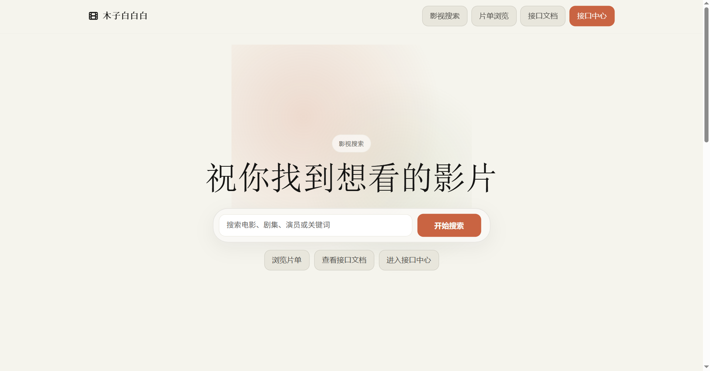
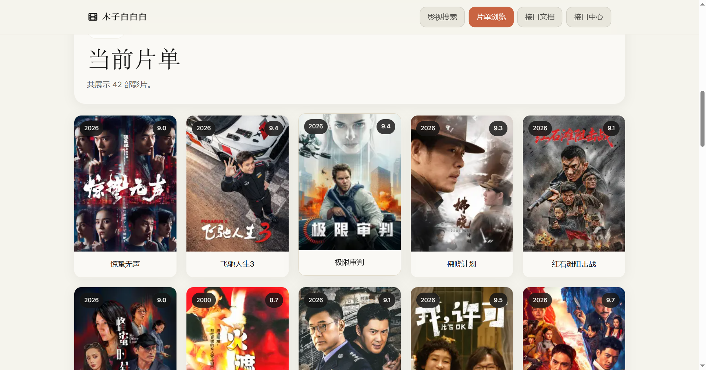

# 木子白白白影视搜索

一个基于 PHP 的影视搜索与片单浏览站点。项目数据来自 2345 影视相关公开页面，会抓取影视列表、搜索结果、详情信息和播放源，并整理成统一的页面与 JSON 接口，适合本地学习、接口验证和轻量部署。

> 本项目仅用于个人学习、接口调试与页面展示。站点数据来自 2345 影视相关公开页面，版权归原权利方所有，请勿用于商业用途。

## 截图

<p align="center">
  
  
</p>

## 功能

- 影视搜索：首页可按电影、剧集、演员或关键词检索。
- 片单浏览：支持从分类、类型、地区、排序等入口浏览影片。
- 详情解析：展示影片名称、海报、评分、年份、地区、导演、演员、简介和播放源。
- 在线播放：详情页内置播放器窗口，并支持在多个解析线路之间切换。
- 接口输出：列表、详情、搜索三类接口均返回 JSON，便于调试或二次展示。
- 图片代理：外部海报可通过 `image.php` 代理，减少跨域和防盗链导致的加载问题。
- 接口中心：`core/` 与 `test/` 页面提供接口文档和验证入口，并通过 `auth.php` 做访问保护。

## 实现方法

项目采用“PHP 抓取解析 + 页面复用接口结果 + 前端播放切线”的方式实现。

1. 后端抓取数据：`core/api.php`、`core/api.search.php`、`core/api.detail.php` 使用 cURL 请求 2345 影视相关公开页面，并统一设置 User-Agent、超时、跳转和 gzip/deflate 支持。
2. 编码兼容处理：接口会根据响应的 `content_type` 判断 GBK/GB2312 页面，并通过 `mb_convert_encoding` 转成 UTF-8，保证 JSON 和页面渲染正常。
3. 正则解析结构：列表接口解析影片卡片、分类、年份、评分和详情地址；搜索接口解析搜索结果与分页；详情接口解析影片信息、海报、简介、播放源和剧集。
4. 统一 JSON 输出：三个接口都输出结构化 JSON，页面层只消费这些结果，不直接把外部 HTML 暴露给前端。
5. 页面复用接口：`index.php` 和 `recommend.php` 在服务端 `include` 本地接口文件并读取 JSON 结果，避免站内再发 HTTP 请求；`info.php` 根据当前请求协议和主机拼出详情接口地址，再拉取影片详情数据。
6. 图片代理：`core/bootstrap.php` 提供 `buildCoverProxyUrl()`，当海报来自外部域名时转换为 `image.php?url=...`，由本地服务代理输出图片。
7. 播放线路切换：`info.php` 渲染播放器和剧集按钮，`assets/js/config.js` 配置解析线路，前端点击线路或剧集时更新 iframe 的播放地址。
8. 受保护工具页：`core/index.php` 与 `test/index.php` 通过 `auth.php` 的 session 口令验证保护，避免接口文档和调试页直接暴露。

## 运行环境

- PHP 7.3+，当前项目已在 PHP 7.3.4 NTS 下验证。
- Web 服务器：Apache、Nginx 或其他可运行 PHP 的环境。
- PHP 扩展：`curl` 必需，`mbstring` 建议启用，用于处理 GBK/GB2312 页面编码。
- 服务器需要能够访问 2345 影视相关公开页面和解析线路域名。

## 快速开始

1. 将项目放到 Web 根目录，或将 Web 服务器站点根目录指向本项目。
2. 确认 PHP 已启用 `curl`，建议同时启用 `mbstring`。
3. 访问首页：

```text
http://localhost/
```

4. 访问受保护页面时，按页面提示输入访问口令。默认口令定义在 `auth.php` 的 `ACCESS_PASSWORD` 中，可按需修改。

## 页面入口

| 路径 | 说明 |
| --- | --- |
| `/` 或 `/index.php` | 影视搜索首页；无关键词时展示推荐片单，有关键词时展示搜索结果 |
| `/recommend.php` | 片单浏览页，展示分类入口与影片列表 |
| `/info.php?playUrl=...` | 影片详情页，展示播放源、剧集、海报、简介和播放器 |
| `/core/` | 接口文档页，受 `auth.php` 保护 |
| `/test/` | 接口中心，受 `auth.php` 保护 |
| `/image.php?url=...` | 外部图片代理接口 |

## JSON 接口

### 列表接口

```text
GET /core/api.php
```

参数：

| 参数 | 类型 | 说明 |
| --- | --- | --- |
| `url` | string | 可选，自定义片单来源地址 |
| `test` | any | 可选，检查服务状态 |

主要返回字段：

```text
success, count, data, categories, info
```

### 详情接口

```text
GET /core/api.detail.php
```

参数：

| 参数 | 类型 | 说明 |
| --- | --- | --- |
| `url` | string | 可选，影片详情页地址 |
| `test` | any | 可选，检查服务状态 |

主要返回字段：

```text
success, name, rating, cover, actors, director, type, region, year, watchType, description, play_links, info
```

### 搜索接口

```text
GET /core/api.search.php
```

参数：

| 参数 | 类型 | 说明 |
| --- | --- | --- |
| `keyword` | string | 可选，搜索关键词 |
| `page` | integer | 可选，页码，默认 `1` |
| `test` | any | 可选，检查服务状态 |

主要返回字段：

```text
success, keyword, count, data, pagination, info
```

## 播放解析配置

详情页播放器解析线路配置位于：

```text
assets/js/config.js
```

可在 `PARSER_CONFIG` 中增删线路，使用 `DEFAULT_PARSER_INDEX` 设置默认线路。每个解析器需要包含：

```js
{
  name: "线路名称",
  url: "https://example.com/?url="
}
```

## 目录结构

```text
.
├── index.php              # 搜索首页与搜索结果页
├── recommend.php          # 片单浏览页
├── info.php               # 影片详情与播放器页面
├── image.php              # 外部海报代理
├── auth.php               # 接口文档和接口中心的访问保护
├── core/
│   ├── bootstrap.php      # 公共配置、URL 工具和图片代理 URL 构建
│   ├── api.php            # 片单列表 JSON 接口
│   ├── api.detail.php     # 影片详情 JSON 接口
│   ├── api.search.php     # 搜索 JSON 接口
│   └── index.php          # 接口文档页
├── test/
│   ├── index.php          # 接口中心
│   ├── test.php           # 列表接口验证页
│   ├── detailtest.php     # 详情接口验证页
│   └── searchtest.php     # 搜索接口验证页
├── assets/
│   ├── css/               # 页面样式
│   ├── js/                # 交互脚本、懒加载和解析线路配置
│   └── images/            # 图标和加载占位图
└── docs/images/           # README 截图
```

## 部署说明

部署时至少需要上传：

- `index.php`
- `recommend.php`
- `info.php`
- `image.php`
- `auth.php`
- `core/`
- `test/`
- `assets/`
- `docs/`（仅用于 README 截图，可不部署到生产环境）

如部署在子目录，项目会通过 `core/bootstrap.php` 自动计算应用基础路径；如果反向代理或 HTTPS 终止在上游，请正确传递 `X-Forwarded-Proto`，避免站内回调协议不一致。

## 验证清单

部署或修改后建议检查：

- 首页 `http://localhost/` 能正常打开。
- 搜索关键词后能返回影片卡片。
- `recommend.php` 能显示片单分类和影片列表。
- 点击影片可进入 `info.php`，并能看到播放源与影片信息。
- `/core/api.php?test=1`、`/core/api.detail.php?test=1`、`/core/api.search.php?test=1` 返回 JSON。
- 受保护的 `/core/` 和 `/test/` 页面能通过 `auth.php` 口令进入。
